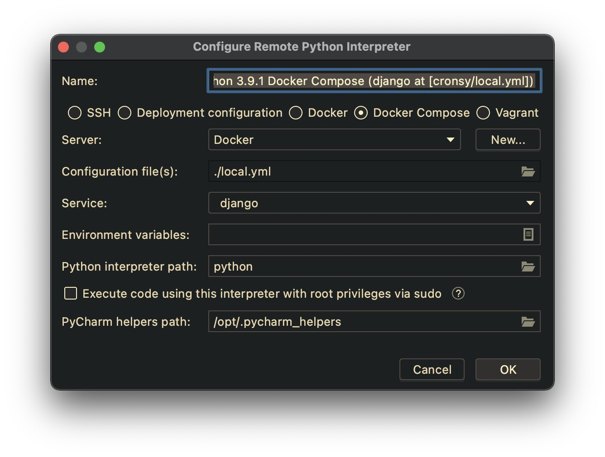
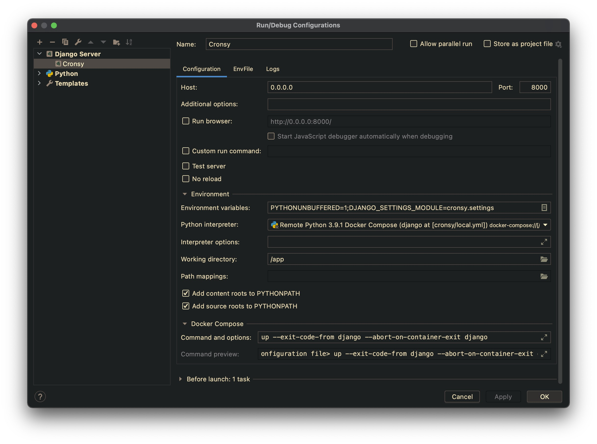
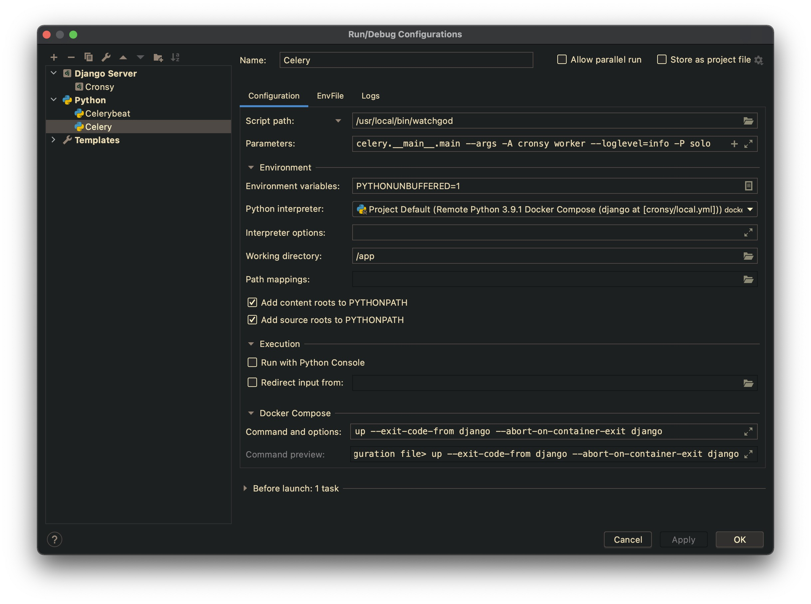

## 🏃‍ Running the project in PyCharm

> The Docker integration features are available only in the Professional version
of PyCharm.

Go to `Preferences` -> `Project` -> `Python Interpreter`. Click the gear icon
and select the `Add...` item.

Select `Docker Compose` and specify your configuration file (`local.yml`) and
the particular service.

> If the corresponding windows are differ on your version of PyCharm, and
> you have troubles with configuring the remote interpreter, you can configure
> classic UI in the registry. Go to `Help` -> `Find Action...` and type `Registry`.
> Find the `python.use.targets.api` option and disable it. Restart PyCharm.

You can also change the interpreter name for better readability later.

You need to specify remote interpreters for each of the containers you are working
with Python. For example, if you have three containers, like `django`, `celeryworker`
and `celerybeat`, you need to setup three remote interpreters.

Now you can go to `Run/Edit Configurations...` and add the particular running configurations.

You can use the standard `Django Server` configuration to run `runserver`
Specify the proper Python Interpreter and set `Host` option to `0.0.0.0`.
It is necessary, because the application server is running inside the container.

You can use `Python` configuration template to run Celery. Do not forget to
set the proper remote interpreter and working directory. Also, set the following options:

- `Script path` : `/usr/local/bin/watchgod`
- `Parameters` : `celery.__main__.main --args -A config worker --loglevel=info -P solo`

Here we use `watchgod` utility to automatically restart Celery if
the source code has been changed.

Also, create the similar configuration for Celery Beat. Use the following options:

- `Script path` : `/usr/local/bin/celery`
- `Parameters` : `-A config beat -l INFO`

Make sure you specify the proper path for `celerybeat.pid` with proper
access rights.

> Configuring runners for the PyCharm is optional but simplify using
> debugger. Anyway you can just use `docker compose -f compose.dev.yml up -d`
> in the terminal.